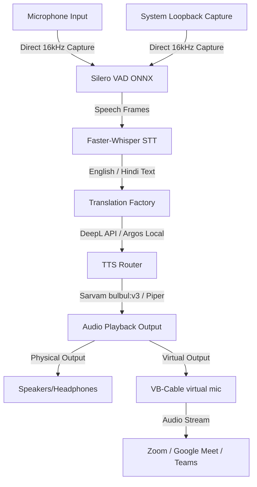

# TalkSync AI 🎙️🔀

TalkSync AI is a high-performance, real-time bilingual desktop speech-to-speech interpreter application built with Python and CustomTkinter. It enables near-zero-latency side-by-side translation during live conversations, presentations, and online meetings.

---

## 🌟 Key Features

*   **Dual-Channel Audio Capture**: Capture microphone speech and system loopback (computer audio) simultaneously at high-quality direct 16kHz sampling rates, bypassing linear resampling distortion.
*   **Virtual Microphone Output**: Stream translated synthesized speech directly to virtual output devices (like VB-Cable) for direct routing into Zoom, Google Meet, Microsoft Teams, and Discord.
*   **Acoustic Echo & Feedback Suppression**: Advanced state-based mute gates suppress speaker audio loops from entering loopback/mic capture.
*   **Robust Neural Engine Stack**:
    *   **STT**: Offline speech-to-text powered by CTranslate2-optimized **Faster-Whisper** (`faster-distil-whisper-large-v3`).
    *   **VAD**: Fast, deep-learning Voice Activity Detection using **Silero VAD ONNX**.
    *   **Translation**: Hybrid translation using the **DeepL API** (primary, proxy-resilient with instant direct fallback) and local **Argos Translate** (offline fallback).
    *   **TTS**: Multilingual speech synthesis utilizing **Sarvam AI** (`bulbul:v3` for high-fidelity Hindi) and **Piper TTS** (optimized local English speech).
*   **Windows 11 Mica Glassmorphism**: Stunning native transparent UI panels customized via Desktop Window Manager (DWM) styling.
*   **Local History Database**: Automatic recording and saving of translation transcripts to an offline SQLite database with interactive post-session AI summaries.

---

## 🏗️ Architecture



---

## ⚙️ Prerequisites & Setup

### 1. Hardware Requirements
*   **GPU**: NVIDIA GPU with CUDA support (Recommended: RTX 40-series or higher with 8GB VRAM) for local Whisper & VAD inference.
*   **Virtual Driver**: [VB-Audio Virtual Cable](https://vb-audio.com/Cable/) installed on the system (for meeting routing).

### 2. Installation
Clone the repository and install the dependencies:
```bash
pip install -r requirements.txt
pip install pywinstyles kokoro-onnx
```

To install the VB-Cable driver silently alongside the application:
```cmd
VBCABLE_Setup_x64.exe -s
```

### 3. Environment Configuration
Create a `.env` file in the root folder:
```env
# Sarvam AI (Hindi TTS)
tts_sarvam_api_key=your_sarvam_key_here
tts_sarvam_voice=shubh
tts_sarvam_lang=hi-IN

# DeepL API
translation_deepl_api_key=your_deepl_key_here

# Audio Overrides (Optional)
audio_input_device_id=37
```

---

## 🚀 Running the Application

Launch the desktop client:
```bash
python main.py
```

### Audio Setup for Meetings (Zoom/Google Meet):
1. In TalkSync AI: Click **audio src >** to open Audio Settings.
2. Check the **Virtual Microphone** box.
3. In Zoom/Meet: Choose **CABLE Output (VB-Audio Virtual Cable)** as your Microphone input.

---

## 🧪 Verification & Testing

Verify transcription accuracy, translation mapping, and E2E latency benchmarks (< 1.5s post-speech) using the programmatic test suite:

```bash
$env:PYTHONPATH="."
pytest tests/test_pipeline_accuracy.py
```
