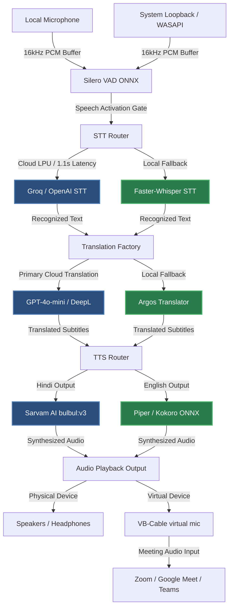

# TalkSync AI 🎙️🔀

[](https://www.python.org/)
[](#)
[](#)
[](#)

**TalkSync AI** is a high-performance, real-time bilingual desktop speech-to-speech interpreter application. It is engineered for near-zero-latency side-by-side translation during live conversations, presentations, and online meetings.

Featuring a beautiful, modern **Glassmorphism/Mica-styled Dark Web UI** served via PyWebView, TalkSync AI orchestrates a robust hybrid local/cloud neural engine pipeline to achieve seamless English ↔ Hindi bidirectional translation.

---

## 🌟 Key Features

### 🖥️ UI & UX
* **Mica Glassmorphic Design**: An elegant, native transparent desktop interface featuring high-fidelity dark-mode aesthetics, real-time audio waveform visualizers, and instant latency profiling.
* **Bilingual Split Panels**: Side-by-side panels display original transcripts and translated subtitles for both speakers in real time.
* **Interactive AI Summaries**: Post-session automatic session notes and intelligent AI-generated conversation summaries stored in a local history database.

### 🎙️ Advanced Audio Routing
* **Dual-Channel Audio Capture**: Independent, simultaneous direct 16kHz capture of local microphone input and WASAPI system loopback (computer audio).
* **Virtual Mic Routing**: Send translated speech directly to virtual output channels (e.g., VB-Audio Cable) to interface seamlessly with applications like **Zoom, Microsoft Teams, Google Meet, and Discord**.
* **Feedback & Echo Suppression**: State-aware mute gates automatically suppress speaker audio loops from feeding back into capture channels.

### 🧠 Neural Engine Stack & Hybrid Fallbacks
* **Voice Activity Detection (VAD)**: Real-time, low-overhead VAD using **Silero VAD ONNX** with adjustable pre-roll buffers and RMS gate thresholding.
* **Speech-to-Text (STT)**: Dual-mode cloud **Groq LPU STT** (`whisper-large-v3-turbo`) and **OpenAI STT** (`whisper-1`) with a local fallback powered by CTranslate2-optimized **Faster-Whisper**.
* **Translation Engine**: Multi-tier translator pairing **GPT-4o-mini** and **DeepL API** with an offline **Argos Translate** fallback.
* **Text-to-Speech (TTS)**: Dual-stream TTS using **Sarvam AI** (`bulbul:v3` for high-fidelity Hindi speech) and **Piper TTS** / **Kokoro ONNX** for fast, high-quality offline English synthesis.

---

## 🏗️ System Architecture

The diagram below details the pipeline workflow from audio capture through neural processing stages down to virtual/physical output devices:



---

## ⚙️ Prerequisites & Installation

### 1. Hardware Requirements
* **GPU**: NVIDIA GPU with CUDA support (Recommended: RTX 30/40-series, $\ge$ 6GB VRAM) for local Faster-Whisper and Silero VAD.
* **Audio Drivers**: [VB-Audio Virtual Cable](https://vb-audio.com/Cable/) installed on the system (required for meeting app integration).

### 2. Quick Installation
Clone the repository and install virtual environment dependencies:

```bash
# Clone the repository
git clone https://github.com/chetan-s20/TalkSync.git
cd TalkSync

# Setup virtual environment and activate
python -m venv .venv
.venv\Scripts\activate

# Install core packages
pip install -r requirements.txt

# Install GUI & ONNX dependencies
pip install pywinstyles kokoro-onnx
```

To install the VB-Cable driver silently alongside the application:
```cmd
VBCABLE_Setup_x64.exe -s
```

---

## 🛠️ Configuration & Secrets

### `.env` Setup
TalkSync loads secret keys and environment configurations from a `.env` file in your project root. Use `.env.example` as a template:

```env
# STT Engine Selection (groq | openai | local)
talksync_stt_engine=groq

# Groq API Keys (Primary & Dedicated Loopback)
groq_api_key=your_groq_api_key_here
groq_loopback_api_key=your_groq_loopback_api_key_here
groq_stt_model=whisper-large-v3-turbo

# OpenAI Configurations
openai_api_key=your_openai_api_key_here
openai_stt_model=gpt-4o-transcribe

# Sarvam AI (Hindi TTS)
tts_sarvam_api_key=your_sarvam_key_here
tts_sarvam_voice=shubh
tts_sarvam_lang=hi-IN

# DeepL Translation
translation_deepl_api_key=your_deepl_key_here

# Audio Overrides (Optional index indices)
audio_input_device_id=
audio_output_device_id=
```

### Configuration File (`config/models_config.json`)
The application saves its parameters in `config/models_config.json` for persistent settings. Sensitive keys are loaded from `.env` at runtime and are kept out of this configuration file to prevent accidental key exposure.

---

## 🚀 Running the Application

### 1. Launch the App
To start the application run:
```bash
python main.py
```

### 2. Audio Routing for Meetings
To route translated speech into a virtual meeting (e.g. Zoom, Google Meet, Teams):
1. Inside TalkSync, open **Settings** (⚙️ button in top right).
2. Under Audio settings, check **Virtual Microphone Enabled**.
3. In Zoom or Google Meet, select **CABLE Output (VB-Audio Virtual Cable)** as your microphone source.
4. TalkSync will now capture system voice/meeting loopback, translate it, and output the translated voice directly into the meeting stream.

---

## 🧪 Testing & Verification

TalkSync AI features a comprehensive opaque-box end-to-end testing suite spanning four distinct verification tiers (75 total test cases):

* **Tier 1 (Feature happy paths)**: Audio stream initialization, Silero VAD, STT trigger logic, translation fallbacks, and bridge events.
* **Tier 2 (Boundaries)**: OOB device index values, 0-channel handles, extreme sample rates, driver crashes, network timeouts, and JSON character limits.
* **Tier 3 (System interactions)**: VAD/TTS interaction gates, language swap hysteresis, context engine propagation, and history recording.
* **Tier 4 (Real-world scenarios)**: Continuous bidirectional streams, WASAPI audio loopback, headset hotplugging, API failover, and rapid session toggling.

Execute the test suites via `pytest`:

```bash
# Run the complete test suite
pytest -v

# Run only the E2E tiers 1-4
pytest tests/tier1_feature/ tests/tier2_boundary/ tests/tier3_pairwise/ tests/tier4_scenarios/ -v
```

---

## 📄 License
This project is licensed under the MIT License - see the LICENSE file for details.
